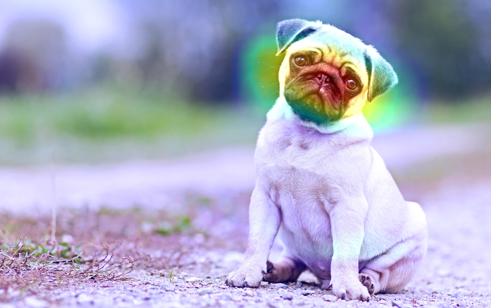
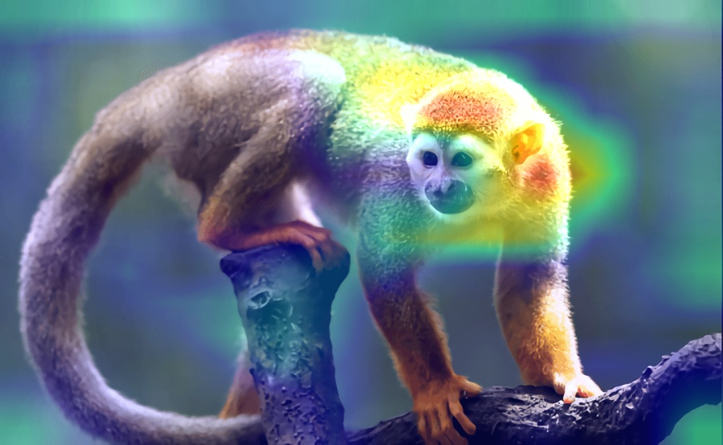
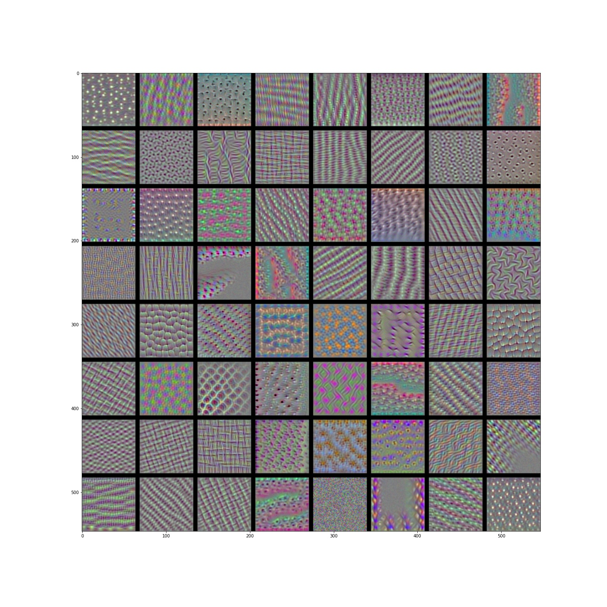
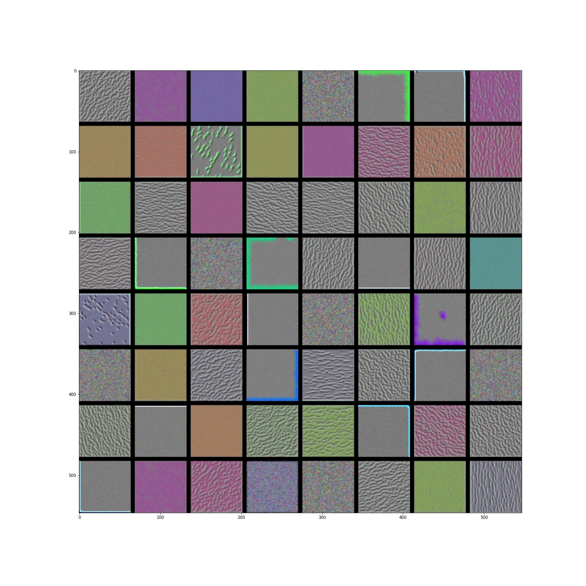

# Weights-Visualizer-for-CNN
What a Neural Network Captures? The filter and feature-maps can be visualized with any image to test with.

Feauture maps closer to the input of model captures a lot of fine detail in the image as we progress deeper in the model, feature map show less detail.

## Heatmaps - What makes Cat different from Monkey

 
 
 

 

## Convnets Filters - What Activates the ConvNet Most

## Feature Map on Bird Image - How Input Changes 
  

This pattern was expected as the model abstracts the features from the image into more general concepts that can be used to make a classification still it is not clear from final image the model saw a bird, we generally lose the ability to interpret these deeper feature maps
